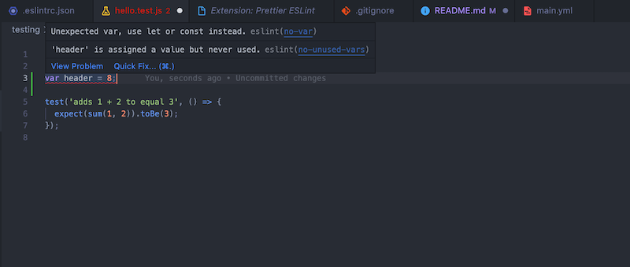

# Rocket Recipes
### Where your palette will be blasting off to the moon, time and time again.

This is Team Rocket's (Team 34) project repository for Rocket Recipes, a web application that allows users to search and create recipes for their own personal culinary escapades. 

---
## Testing
### Installation
**Step 1:** Install npm on your local machine

[Click here](https://docs.npmjs.com/downloading-and-installing-node-js-and-npm) to learn how to install Node.js and npm

**Step 2:** Install testing packages

We are using Jest and Cypress to test our application, and you need to install both of them to get our tests working. First, install the testing packages by typing:
`npm install`

### Running Tests
We have two different types of tests, unit tests and end to end tests.

Our unit tests are done with Jest. To go through all unit tests, run the command

`npm run test-unit`

Our end to end tests are done with Cypress. To go through each of these tests, run the command

`npm run test-e2e`

---
## Formatting
We are using ESLint and Prettier to format our files. For this reason, I've included their respective packages in our package.json.

We are using the [Airbnb](https://github.com/airbnb/javascript) style guide to format our code.
### Installation
The required packages will automatically be installed when you run `npm install` for the first time.

In order to get the linting to work inside your VSCode, please intall the following extentions:

[ESLint](https://marketplace.visualstudio.com/items?itemName=dbaeumer.vscode-eslint)

[Prettier ESLint](https://marketplace.visualstudio.com/items?itemName=rvest.vs-code-prettier-eslint)

Once you get these working, it should show you when you have style errors within your VSCode! 

As you can see below, I'm using the var keyword which is a big no-go in modern JavaScript. VSCode makes the file header red and highlights the line. When I hover over that line, it tells me what I did wrong and I can easily change it!

### Usage

Before you commit your code, run the command 

`npm run lint`

This will automatically format your code, and if it is not able to, show you what styling or formatting errors you have.

**You will not be able to merge your code into main until it passes all of the ESLint tests.**